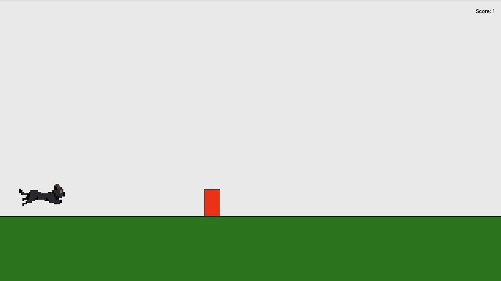
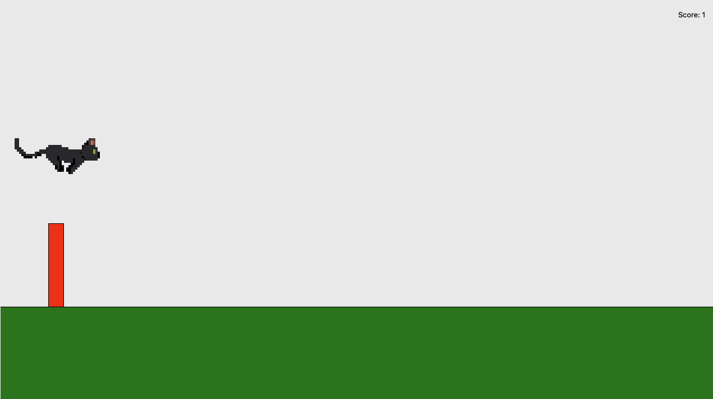

# Cat-Jump-Jump

## Description

Someone once told me that the best way to learn coding was through making game. So, instead of creating a functional productivity app, I decided to recreate Chrome's dino running game. I name this Cat Jump Jump.

## Gameplay




- You play as a cat running away, avoid incoming obstacles by jumping and score the highest possible score. Game ends when you collide into an obstacle.

**Controls:**

- Jump: Space
- Restart: R (Only when game is over)
- Pause: P
- Quit Game: Esc/Q

## Project Structure

- `main.py`  
  Runs the Tkinter app, game loop, input bindings, sprite rendering, and UI updates.
- `entities.py`  
  Defines `Cat`, `Obstacle`, and `Ground` data/models plus movement and collision helpers.
- `game_logic.py`  
  Handles obstacle spawning, obstacle updates, collision checks, and cleanup.
- `config.py`  
  Stores constants (window size, physics, animation timing, colors, scaling).
- `assets/`  
  Contains GIF sprites (`cat_run.gif`, `cat_jump.gif`, etc.).

## Setup

1. Clone Repository

```bash
git clone https://github.com/gab-lee/Cat-Jump-Jump
cd Cat-Jump-Jump
```

2. Set up virtual env

```bash
python3 -m venv .venv
```

3. Activate virtual env

```bash
source .venv/bin/activate
```

4. Install dependencies

```bash
python -m pip install --upgrade
python -m pip install -r requirements.txt
```

5. Run game

```bash
python main.py
```

NB: If `python` not found, use `python3`

## Known Issues

- Once paused, there is no way to unpause the game

## Possible upgrades

- Pause will open a menu screen
- Changing of sprites from cat -> dog, allowing change to happen from menu

## Credits

- Sprites were made on [pixel lab](https://www.pixellab.ai/)
